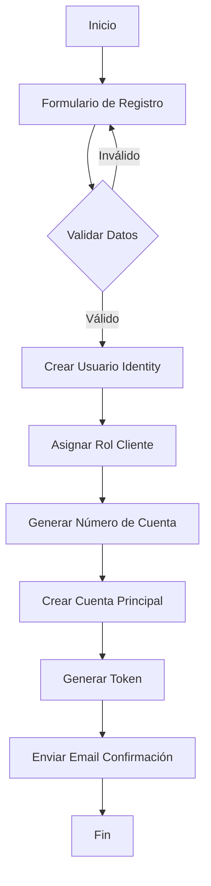
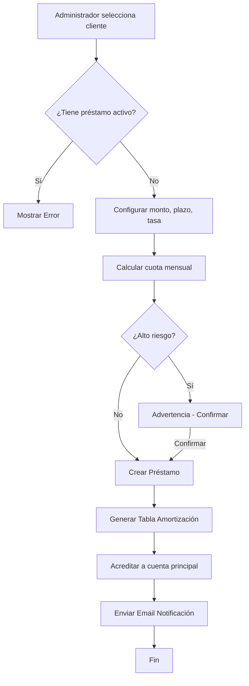
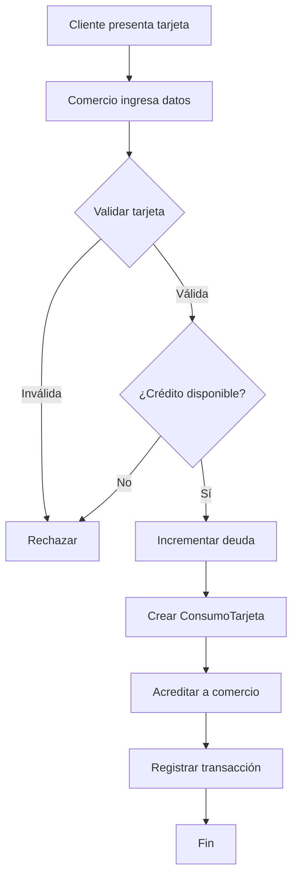

# Documentación del Proyecto ArtemisBanking
**Estudiantes:**  
- Diomar Arianny Fleming Díaz (2024-1872)  
- Adonis Mercedes Buret (2021-2396)

---

## 1. Descripción General

**ArtemisBanking** es un sistema bancario integral desarrollado con **ASP.NET Core (.NET 9)** utilizando el patrón **Razor Pages** y arquitectura en capas. 
El sistema permite la gestión completa de operaciones bancarias, incluyendo cuentas de ahorro, préstamos, tarjetas de crédito, transacciones, y gestión de comercios afiliados.

### Objetivo del Proyecto
Proporcionar una plataforma bancaria segura, escalable y fácil de usar que permita:
- Gestión de usuarios con múltiples roles (Administrador, Cajero, Cliente, Comercio)
- Administración de productos financieros (Cuentas, Préstamos, Tarjetas)
- Procesamiento de transacciones bancarias en tiempo real
- Sistema de comercios afiliados para pagos con tarjeta
- Dashboards personalizados por tipo de usuario

---

## 2. Arquitectura del Sistema

### 2.1 Patrón Arquitectónico
El proyecto implementa **Arquitectura en Capas (Layered Architecture)** con separación clara de responsabilidades:

```
┌─────────────────────────────────────────────┐
│         ArtemisBanking (Presentación)       │
│         Razor Pages + Controllers           │
├─────────────────────────────────────────────┤
│      ArtemisBanking.Application             │
│    Servicios, DTOs, ViewModels, Mappers     │
├─────────────────────────────────────────────┤
│      ArtemisBanking.Infrastructure          │
│   Repositorios, DbContext, Configuraciones  │
├─────────────────────────────────────────────┤
│         ArtemisBanking.Domain               │
│      Entidades, Interfaces, Enums           │
└─────────────────────────────────────────────┘
│         ArtemisBanking.Api (Opcional)       │
│            API REST para consumo            │
└─────────────────────────────────────────────┘
```

### 2.2 Capas del Sistema

#### **Capa de Dominio (Domain)**
- **Responsabilidad:** Entidades del negocio y contratos (interfaces)
- **Contenido:**
  - Entidades: `Usuario`, `CuentaAhorro`, `Prestamo`, `TarjetaCredito`, `Comercio`, `Transaccion`
  - Interfaces de repositorios
  - Enumeraciones: `TipoUsuario`, `TipoTransaccion`, `EstadoTransaccion`

#### **Capa de Infraestructura (Infrastructure)**
- **Responsabilidad:** Acceso a datos y persistencia
- **Contenido:**
  - `ArtemisBankingDbContext` (Entity Framework Core)
  - Implementación de repositorios
  - Configuraciones de entidades (Fluent API)
  - Migraciones de base de datos
  - `DbSeeder` para datos iniciales

#### **Capa de Aplicación (Application)**
- **Responsabilidad:** Lógica de negocio y orquestación
- **Contenido:**
  - Servicios de negocio (`ServicioUsuario`, `ServicioPrestamo`, `ServicioTarjeta`, etc.)
  - DTOs (Data Transfer Objects)
  - ViewModels para vistas
  - Mappers (AutoMapper)
  - Validaciones de negocio

#### **Capa de Presentación (Web)**
- **Responsabilidad:** Interfaz de usuario y controladores
- **Contenido:**
  - Controllers MVC
  - Razor Views
  - Validaciones del lado del cliente
  - Estilos CSS personalizados (Bootstrap + tema morado)

---

## 3. Base de Datos

### 3.1 Motor y Configuración
- **Motor:** SQL Server
- **ORM:** Entity Framework Core 9.0
- **Estrategia:** Code-First con migraciones

### 3.2 Diagrama de Entidades Principales

```
┌─────────────────┐         ┌──────────────────┐
│     Usuario     │◄───────►│    Comercio      │
│  (IdentityUser) │         │                  │
├─────────────────┤         ├──────────────────┤
│ Id (PK)         │         │ Id (PK)          │
│ Nombre          │         │ Nombre           │
│ Apellido        │         │ RNC              │
│ Cedula          │         │ UsuarioId (FK)   │
│ Email           │         │ EstaActivo       │
│ EstaActivo      │         └──────────────────┘
│ ComercioId (FK) │
└─────────────────┘
         │
         ├─────────┬─────────┬──────────┐
         │         │         │          │
         ▼         ▼         ▼          ▼
┌─────────────┐ ┌────────┐ ┌────────┐ ┌────────────┐
│CuentaAhorro │ │Prestamo│ │Tarjeta │ │Beneficiario│
├─────────────┤ ├────────┤ ├────────┤ ├────────────┤
│Id (PK)      │ │Id (PK) │ │Id (PK) │ │Id (PK)     │
│NumeroCuenta │ │Numero  │ │Numero  │ │Nombre      │
│Balance      │ │Monto   │ │Limite  │ │Cuenta      │
│EsPrincipal  │ │Tasa    │ │Deuda   │ │Banco       │
│UsuarioId(FK)│ │Plazo   │ │CVC     │ │UsuarioId   │
└─────────────┘ └────────┘ └────────┘ └────────────┘
      │              │           │
      │              │           │
      ▼              ▼           ▼
┌──────────────┐ ┌──────────┐ ┌──────────────┐
│ Transaccion  │ │CuotaPres.│ │ConsumoTarjeta│
├──────────────┤ ├──────────┤ ├──────────────┤
│Id (PK)       │ │Id (PK)   │ │Id (PK)       │
│Monto         │ │FechaPago │ │Monto         │
│Tipo          │ │Monto     │ │ComercioId    │
│Estado        │ │EstaPagada│ │TarjetaId     │
│Beneficiario  │ │PrestamoId│ │FechaConsumo  │
│CuentaId (FK) │ └──────────┘ └──────────────┘
└──────────────┘
```

### 3.3 Tablas Principales

| Tabla | Descripción | Campos Clave |
|-------|-------------|--------------|
| **AspNetUsers** | Usuarios del sistema (Identity) | Id, Nombre, Apellido, Cedula, Email, ComercioId |
| **CuentasAhorro** | Cuentas bancarias | NumeroCuenta (9 dígitos), Balance, EsPrincipal |
| **Prestamos** | Préstamos otorgados | NumeroPrestamo, MontoCapital, TasaInteres, PlazoMeses |
| **TarjetasCredito** | Tarjetas de crédito | NumeroTarjeta (16 dígitos), LimiteCredito, DeudaActual |
| **Comercios** | Comercios afiliados | Nombre, RNC, UsuarioId |
| **Transacciones** | Movimientos bancarios | Monto, TipoTransaccion, EstadoTransaccion |
| **CuotasPrestamo** | Tabla de amortización | FechaPago, MontoCuota, EstaPagada |
| **ConsumosTarjeta** | Compras con TC | Monto, ComercioId, TarjetaId |

---

## 4. Roles y Permisos

### 4.1 Tipos de Usuario

El sistema implementa **4 roles principales**:

#### 🔵 **Administrador**
- **Funciones:**
  - Gestión completa de usuarios (CRUD)
  - Asignación de préstamos
  - Asignación de tarjetas de crédito
  - Creación de cuentas secundarias
  - Gestión de comercios
  - Visualización de dashboards administrativos
  - Modificación de tasas de interés
- **Política de Acceso:** `SoloAdministrador`

#### 🟢 **Cajero**
- **Funciones:**
  - Realizar depósitos en cuentas
  - Procesar retiros
  - Registrar pagos de préstamos
  - Registrar pagos de tarjetas de crédito
  - Consultar información de clientes
  - Dashboard con estadísticas del día
- **Política de Acceso:** `SoloCajero`

#### 🟡 **Cliente**
- **Funciones:**
  - Consultar cuentas de ahorro
  - Ver historial de transacciones
  - Transferir entre cuentas propias
  - Transferir a beneficiarios
  - Gestionar beneficiarios
  - Ver préstamos activos
  - Ver tarjetas de crédito
  - Realizar pagos de servicios
- **Política de Acceso:** `SoloCliente`

#### 🟣 **Comercio**
- **Funciones:**
  - Procesar pagos con tarjeta de crédito
  - Consultar consumos realizados
  - Ver historial de transacciones
  - Gestionar perfil del comercio
- **Política de Acceso:** `SoloComercio`

---

## 5. Funcionalidades Principales

### 5.1 Gestión de Usuarios

#### Creación de Usuarios
```csharp
// Flujo de creación
1. Validar datos (nombre, correo, cédula únicos)
2. Crear usuario con UserManager
3. Asignar rol correspondiente
4. Si es Cliente → crear cuenta principal
5. Si es Comercio → asociar a comercio existente
6. Generar token de confirmación
7. Enviar correo de activación
```

#### Roles disponibles:
- Administrador
- Cajero
- Cliente
- Comercio

### 5.2 Cuentas de Ahorro

#### Características:
- **Cuenta Principal:** Automática al registrarse como cliente
- **Cuentas Secundarias:** Pueden crearse múltiples
- **Número de Cuenta:** 9 dígitos únicos generados aleatoriamente
- **Balance:** Precisión decimal (18,2)

#### Operaciones:
- ✅ Crear cuenta secundaria
- ✅ Transferir entre cuentas propias
- ✅ Cancelar cuenta secundaria (transfiere fondos a principal)
- ✅ Consultar movimientos

### 5.3 Préstamos

#### Sistema de Amortización Francés
```csharp
Cuota Mensual = P * [r(1+r)^n] / [(1+r)^n - 1]

Donde:
- P = Monto del préstamo (capital)
- r = Tasa de interés mensual (anual/12)
- n = Número de cuotas (meses)
```

#### Características:
- **Plazos disponibles:** 6, 12, 18, 24, 30, 36, 42, 48, 54, 60 meses
- **Tasa de interés:** Configurable por préstamo
- **Validación de riesgo:** Compara deuda vs promedio del sistema
- **Tabla de amortización:** Generada automáticamente
- **Seguimiento:** Cuotas pagadas/pendientes, estado de mora

#### Proceso de asignación:
1. Seleccionar cliente sin préstamo activo
2. Configurar monto, plazo y tasa
3. Validar riesgo crediticio
4. Generar tabla de amortización
5. Acreditar fondos a cuenta principal
6. Enviar notificación por correo

### 5.4 Tarjetas de Crédito

#### Características:
- **Número:** 16 dígitos únicos
- **CVC:** Cifrado con SHA-256
- **Fecha de expiración:** Formato MM/AA (5 años de vigencia)
- **Límite de crédito:** Configurable
- **Crédito disponible:** Calculado en tiempo real

#### Operaciones:
- ✅ Asignación de tarjeta
- ✅ Realizar consumos en comercios
- ✅ Pago de deuda (total o parcial)
- ✅ Modificación de límite
- ✅ Cancelación de tarjeta

### 5.5 Transacciones

#### Tipos de Transacción:
- **DÉBITO:** Salida de fondos (retiros, transferencias salientes, pagos)
- **CRÉDITO:** Entrada de fondos (depósitos, transferencias entrantes, acreditaciones)

#### Estados:
- **APROBADA:** Transacción exitosa
- **RECHAZADA:** Transacción fallida

#### Registro Completo:
- Fecha y hora
- Monto
- Tipo (DÉBITO/CRÉDITO)
- Origen
- Beneficiario
- Estado
- Cuenta asociada

### 5.6 Comercios

#### Gestión de Comercios:
1. **Registro:** Nombre, RNC único
2. **Asignación de Usuario:** Un usuario con rol "Comercio" por negocio
3. **Cuenta de Ahorro:** Se crea automáticamente con balance $0
4. **Procesamiento de Pagos:** Consumos con tarjetas de crédito

#### Relación Bidireccional:
```csharp
Usuario.ComercioId → Comercio.Id
Comercio.UsuarioId → Usuario.Id
```

---

## 6. Servicios Principales

### 6.1 ServicioUsuario
```csharp
public interface IServicioUsuario
{
    Task<ResultadoOperacion<UsuarioDTO>> CrearUsuarioAsync(CrearUsuarioDTO datos);
    Task<ResultadoOperacion> ActualizarUsuarioAsync(ActualizarUsuarioDTO datos);
    Task<ResultadoOperacion> CambiarEstadoAsync(string usuarioId, string usuarioActualId);
    Task<ResultadoOperacion<DashboardAdminDTO>> ObtenerDashboardAdminAsync();
    Task<ResultadoOperacion<IEnumerable<UsuarioDTO>>> ObtenerClientesActivosAsync();
}
```

### 6.2 ServicioPrestamo
```csharp
public interface IServicioPrestamo
{
    Task<ResultadoOperacion<PrestamoDTO>> AsignarPrestamoAsync(AsignarPrestamoDTO datos);
    Task<ResultadoOperacion> ActualizarTasaInteresAsync(ActualizarTasaPrestamoDTO datos);
    Task<ResultadoOperacion<bool>> ValidarRiesgoClienteAsync(string clienteId, decimal montoNuevoPrestamo);
    Task<ResultadoOperacion<decimal>> ObtenerDeudaPromedioAsync();
}
```

### 6.3 ServicioTarjetaCredito
```csharp
public interface IServicioTarjetaCredito
{
    Task<ResultadoOperacion<TarjetaCreditoDTO>> AsignarTarjetaAsync(AsignarTarjetaDTO datos);
    Task<ResultadoOperacion> ProcesarConsumoAsync(ProcesarConsumoDTO datos);
    Task<ResultadoOperacion> PagarDeudaTarjetaAsync(PagarDeudaTarjetaDTO datos);
    Task<ResultadoOperacion> ActualizarLimiteAsync(ActualizarLimiteTarjetaDTO datos);
}
```

### 6.4 ServicioCuentaAhorro
```csharp
public interface IServicioCuentaAhorro
{
    Task<ResultadoOperacion<CuentaAhorroDTO>> CrearCuentaSecundariaAsync(CrearCuentaSecundariaDTO datos);
    Task<ResultadoOperacion> TransferirEntreCuentasPropiasAsync(TransferirEntrePropiasDTO datos);
    Task<ResultadoOperacion> CancelarCuentaAsync(int cuentaId);
}
```

### 6.5 ServicioTransaccion
```csharp
public interface IServicioTransaccion
{
    Task<ResultadoOperacion> RealizarDepositoAsync(RealizarDepositoDTO datos);
    Task<ResultadoOperacion> RealizarRetiroAsync(RealizarRetiroDTO datos);
    Task<ResultadoOperacion> TransferirABeneficiarioAsync(TransferirBeneficiarioDTO datos);
    Task<IEnumerable<TransaccionDTO>> ObtenerTransaccionesPorCuentaAsync(int cuentaId);
}
```

---

## 7. Patrones de Diseño Utilizados

### 7.1 Repository Pattern
**Objetivo:** Abstracción del acceso a datos

```csharp
public interface IRepositorioGenerico<T> where T : EntidadBase
{
    Task<T> ObtenerPorIdAsync(int id);
    Task<IEnumerable<T>> ObtenerTodosAsync();
    Task AgregarAsync(T entidad);
    Task ActualizarAsync(T entidad);
    Task EliminarAsync(int id);
    Task GuardarCambiosAsync();
}
```

### 7.2 Unit of Work Pattern
**Objetivo:** Coordinar transacciones entre múltiples repositorios

```csharp
public class UnitOfWork : IUnitOfWork
{
    private readonly ArtemisBankingDbContext _context;
    
    public IRepositorioCuentaAhorro Cuentas { get; }
    public IRepositorioPrestamo Prestamos { get; }
    public IRepositorioTarjetaCredito Tarjetas { get; }
    
    public async Task<int> GuardarCambiosAsync()
    {
        return await _context.SaveChangesAsync();
    }
}
```

### 7.3 DTO Pattern
**Objetivo:** Transferencia de datos entre capas sin exponer entidades de dominio

```csharp
public class UsuarioDTO
{
    public string Id { get; set; }
    public string NombreCompleto { get; set; }
    public string Correo { get; set; }
    public string Rol { get; set; }
    public bool EstaActivo { get; set; }
}
```

### 7.4 Service Layer Pattern
**Objetivo:** Encapsular lógica de negocio

```csharp
public class ServicioPrestamo : IServicioPrestamo
{
    private readonly IRepositorioPrestamo _repositorioPrestamo;
    private readonly IServicioCalculoPrestamo _servicioCalculo;
    private readonly IServicioCorreo _servicioCorreo;
    
    // Lógica de negocio compleja
}
```

### 7.5 AutoMapper
**Objetivo:** Mapeo automático entre entidades y DTOs

```csharp
public class MappingProfile : Profile
{
    public MappingProfile()
    {
        CreateMap<Usuario, UsuarioDTO>()
            .ForMember(dest => dest.NombreCompleto, 
                       opt => opt.MapFrom(src => $"{src.Nombre} {src.Apellido}"));
    }
}
```

---

## 8. Seguridad

### 8.1 Autenticación
- **ASP.NET Core Identity** para gestión de usuarios
- **Cookies de autenticación** con tiempo de expiración configurable
- **Confirmación de correo electrónico** obligatoria
- **Tokens de reseteo de contraseña** con expiración

### 8.2 Autorización
```csharp
// Políticas de autorización
services.AddAuthorization(options =>
{
    options.AddPolicy("SoloAdministrador", policy => 
        policy.RequireRole("Administrador"));
    
    options.AddPolicy("SoloCajero", policy => 
        policy.RequireRole("Cajero"));
    
    options.AddPolicy("SoloCliente", policy => 
        policy.RequireRole("Cliente"));
    
    options.AddPolicy("SoloComercio", policy => 
        policy.RequireRole("Comercio"));
});
```

### 8.3 Cifrado
- **Contraseñas:** Hasheadas con Identity (PBKDF2)
- **CVC de tarjetas:** SHA-256
- **Tokens:** Generados criptográficamente

### 8.4 Validaciones
- **Lado del servidor:** Data Annotations + FluentValidation
- **Lado del cliente:** jQuery Validation
- **Unicidad:** Email, Username, Cédula, Número de Cuenta/Tarjeta
- **Formato:** Validación de cédula (11 dígitos), emails, montos

---

## 9. Tecnologías y Librerías

### 9.1 Framework Principal
- **.NET 9.0**
- **ASP.NET Core MVC (Razor Pages)**
- **Entity Framework Core 9.0**

### 9.2 Dependencias Clave

```xml
<PackageReference Include="Microsoft.AspNetCore.Identity.EntityFrameworkCore" Version="9.0.0" />
<PackageReference Include="Microsoft.EntityFrameworkCore.SqlServer" Version="9.0.0" />
<PackageReference Include="Microsoft.EntityFrameworkCore.Tools" Version="9.0.0" />
<PackageReference Include="AutoMapper.Extensions.Microsoft.DependencyInjection" Version="12.0.0" />
<PackageReference Include="Serilog.AspNetCore" Version="8.0.0" />
<PackageReference Include="FluentValidation.AspNetCore" Version="11.3.0" />
```

### 9.3 Frontend
- **Bootstrap 5.3**
- **jQuery 3.7**
- **Font Awesome 6.0**
- **SweetAlert2** (alertas personalizadas)
- **DataTables** (tablas dinámicas)

### 9.4 Herramientas de Desarrollo
- **Visual Studio 2022**
- **SQL Server Management Studio**
- **Postman** (para API testing)
- **Git/GitHub** (control de versiones)

---

## 10. Flujos de Trabajo Principales

### 10.1 Registro de Cliente



### 10.2 Asignación de Préstamo



### 10.3 Pago con Tarjeta en Comercio



---

## 11. Dashboards

### 11.1 Dashboard Administrador
**Métricas mostradas:**
- Total de transacciones
- Transacciones del día
- Total de pagos
- Pagos del día
- Clientes activos/inactivos
- Préstamos vigentes
- Tarjetas activas
- Cuentas de ahorro
- Deuda promedio por cliente
- Total de productos financieros

### 11.2 Dashboard Cajero
**Métricas mostradas:**
- Transacciones realizadas hoy
- Pagos procesados hoy
- Depósitos del día
- Retiros del día

### 11.3 Dashboard Cliente
**Información mostrada:**
- Balance total (suma de todas las cuentas)
- Cuentas de ahorro
- Préstamos activos
- Tarjetas de crédito
- Últimas transacciones
- Beneficiarios registrados

### 11.4 Dashboard Comercio
**Información mostrada:**
- Total de consumos procesados
- Monto total acumulado
- Balance de cuenta
- Últimos consumos
- Estadísticas mensuales

---

## 12. Validaciones de Negocio

### 12.1 Préstamos
✅ Cliente solo puede tener **1 préstamo activo** a la vez  
✅ Validación de **riesgo crediticio** (deuda vs promedio)  
✅ Plazos permitidos: **6 a 60 meses** (múltiplos de 6)  
✅ Tasa de interés: **> 0% y < 100%**  
✅ Monto: **> $0**

### 12.2 Tarjetas de Crédito
✅ Cliente puede tener **múltiples tarjetas**  
✅ Número único de **16 dígitos**  
✅ Consumo no puede exceder **crédito disponible**  
✅ Pago no puede exceder **deuda actual**  
✅ Límite de crédito **> $0**

### 12.3 Cuentas de Ahorro
✅ **1 cuenta principal** (no se puede cancelar)  
✅ **Múltiples cuentas secundarias** permitidas  
✅ Cancelación de secundaria **transfiere fondos a principal**  
✅ Número único de **9 dígitos**  
✅ Balance **≥ $0**

### 12.4 Transacciones
✅ Retiros/transferencias requieren **fondos suficientes**  
✅ Transferencias entre cuentas propias **mismo usuario**  
✅ Transferencias a beneficiarios **validar cuenta destino**  
✅ Monto **> $0**  
✅ Cuentas deben estar **activas**

---

## 13. Sistema de Notificaciones

### 13.1 Correos Electrónicos
El sistema envía notificaciones automáticas por email:

| Evento | Destinatario | Contenido |
|--------|--------------|-----------|
| Registro de usuario | Cliente | Token de confirmación + link |
| Préstamo aprobado | Cliente | Monto, plazo, tasa, cuota mensual |
| Cambio de tasa de préstamo | Cliente | Nueva tasa, nueva cuota |
| Tarjeta asignada | Cliente | Últimos 4 dígitos, límite, fecha exp. |
| Consumo en comercio | Cliente | Monto, comercio, crédito disponible |
| Pago de préstamo | Cliente | Cuota pagada, saldo pendiente |
| Pago de tarjeta | Cliente | Monto pagado, nueva deuda |

### 13.2 Plantillas de Email
- Diseño HTML responsivo
- Branding del banco 
- Información clara y concisa
- Botones de acción (call-to-action)

---

## 14. Inicialización de Datos (DbSeeder)

### 14.1 Datos de Prueba Creados

**Roles:**
```csharp
- Administrador
- Cajero
- Cliente
- Comercio
```

**Usuarios de Prueba:**
| Usuario | Contraseña | Rol | Email |
|---------|------------|-----|-------|
| admin | Admin123! | Administrador | admin@artemisbanking.com |
| cajero | Cajero123! | Cajero | cajero@artemisbanking.com |
| cliente | Cliente123! | Cliente | cliente@artemisbanking.com |
| comercio | Comercio123! | Comercio | comercio@artemisbanking.com |

**Comercios de Prueba:**
1. Supermercado La Economía (RNC: 130123456)
2. Farmacia Carol (RNC: 130987654)
3. Restaurante El Buen Sabor (RNC: 130555555)

**Cuentas de Prueba:**
- Cliente: 1 cuenta principal con $10,000
- Comercio: 1 cuenta principal con $0

---

## 15. Configuración y Ejecución

### 15.1 Requisitos Previos
- ✅ Visual Studio 2022 o superior
- ✅ .NET 9 SDK
- ✅ SQL Server 2019+
- ✅ Git (opcional)

### 15.2 Pasos de Instalación

1. **Clonar repositorio:**
```bash
git clone https://github.com/AdonisMBuret/ArtemisBanking.git
cd ArtemisBanking
```

2. **Restaurar paquetes NuGet:**
```bash
dotnet restore
```

3. **Configurar cadena de conexión:**
Editar `appsettings.json`:
```json
{
  "ConnectionStrings": {
    "DefaultConnection": "Server=(localdb)\\mssqllocaldb;Database=ArtemisBankingDB;Trusted_Connection=True;"
  }
}
```

4. **Aplicar migraciones:**
```bash
cd ArtemisBanking
dotnet ef database update
```

5. **Ejecutar aplicación:**
```bash
dotnet run
```

6. **Acceder:**
Navegar a: `https://localhost:7103`

### 15.3 Configuración de Email (Opcional)
Editar `appsettings.json`:
```json
{
  "EmailSettings": {
    "SmtpServer": "smtp.gmail.com",
    "SmtpPort": 587,
    "SenderEmail": "noreply@artemisbanking.com",
    "SenderName": "ArtemisBanking",
    "Username": "your-email@gmail.com",
    "Password": "your-app-password"
  }
}
```

---

## 16. Estructura de Directorios

```
ArtemisBanking/
│
├── ArtemisBanking/                    # Capa de Presentación
│   ├── Controllers/                   # Controladores MVC
│   │   ├── AdminController.cs
│   │   ├── CajeroController.cs
│   │   ├── ClienteController.cs
│   │   ├── ComercioController.cs
│   │   └── PortalComercioController.cs
│   │
│   ├── Views/                         # Vistas Razor
│   │   ├── Admin/
│   │   ├── Cajero/
│   │   ├── Cliente/
│   │   ├── Comercio/
│   │   └── Shared/
│   │
│   ├── wwwroot/                       # Archivos estáticos
│   │   ├── css/
│   │   ├── js/
│   │   └── lib/
│   │
│   ├── Program.cs                     # Punto de entrada
│   └── appsettings.json              # Configuración
│
├── ArtemisBanking.Application/        # Capa de Aplicación
│   ├── DTOs/                          # Data Transfer Objects
│   ├── Interfaces/                    # Interfaces de servicios
│   ├── Services/                      # Implementación de servicios
│   ├── ViewModels/                    # ViewModels para vistas
│   └── Mappers/                       # Perfiles de AutoMapper
│
├── ArtemisBanking.Domain/             # Capa de Dominio
│   ├── Entities/                      # Entidades del negocio
│   │   ├── Usuario.cs
│   │   ├── CuentaAhorro.cs
│   │   ├── Prestamo.cs
│   │   ├── TarjetaCredito.cs
│   │   ├── Comercio.cs
│   │   └── Transaccion.cs
│   │
│   ├── Interfaces/                    # Interfaces de repositorios
│   └── Enums/                         # Enumeraciones
│
├── ArtemisBanking.Infrastructure/     # Capa de Infraestructura
│   ├── Data/                          # Contexto y configuraciones
│   │   ├── ArtemisBankingDbContext.cs
│   │   ├── DbSeeder.cs
│   │   └── Configurations/
│   │
│   ├── Repositories/                  # Implementación de repositorios
│   └── Migrations/                    # Migraciones EF Core
│
└── ArtemisBanking.Api/                # API REST (Opcional)
    ├── Controllers/
    └── Program.cs
```

---

## 17. Mejores Prácticas Implementadas

### 17.1 Código Limpio
✅ **Nombres descriptivos** en variables, métodos y clases  
✅ **Separación de responsabilidades** (cada clase tiene un propósito)  
✅ **Principio DRY** (Don't Repeat Yourself)  
✅ **Comentarios XML** en métodos públicos  
✅ **Logging** con niveles apropiados (Info, Warning, Error)

### 17.2 Seguridad
✅ **Validación en servidor y cliente**  
✅ **Anti-forgery tokens** en formularios  
✅ **Sanitización** de inputs  
✅ **Autorización basada en políticas**  
✅ **Cifrado** de datos sensibles

### 17.3 Performance
✅ **Queries optimizadas** con Include/ThenInclude  
✅ **Paginación** en listados grandes  
✅ **Índices** en campos de búsqueda frecuente  
✅ **Async/await** en operaciones I/O  
✅ **DTOs ligeros** para transferencia de datos

### 17.4 Mantenibilidad
✅ **Arquitectura en capas** bien definida  
✅ **Inyección de dependencias**  
✅ **Patrones de diseño** probados  
✅ **Configuración externalizada**  
✅ **Logs estructurados**

---

## 18. Pruebas y Validación

### 18.1 Casos de Prueba Críticos

**Préstamos:**
- ✅ Cliente sin préstamo puede solicitar
- ✅ Cliente con préstamo activo es rechazado
- ✅ Validación de riesgo funciona correctamente
- ✅ Tabla de amortización se genera bien
- ✅ Fondos se acreditan a cuenta principal

**Tarjetas:**
- ✅ Consumo con crédito suficiente se aprueba
- ✅ Consumo sin crédito se rechaza
- ✅ Pago reduce deuda correctamente
- ✅ Límite de crédito se actualiza

**Cuentas:**
- ✅ Cuenta principal no se puede cancelar
- ✅ Cuenta secundaria transfiere fondos al cancelar
- ✅ Transferencias validan fondos suficientes
- ✅ Balance no puede ser negativo

**Usuarios:**
- ✅ Email único se valida
- ✅ Username único se valida
- ✅ Confirmación de email funciona
- ✅ Roles se asignan correctamente

### 18.2 Validación de Datos

```csharp
// Ejemplo de validación con FluentValidation
public class CrearPrestamoValidator : AbstractValidator<AsignarPrestamoDTO>
{
    public CrearPrestamoValidator()
    {
        RuleFor(x => x.MontoCapital)
            .GreaterThan(0).WithMessage("El monto debe ser mayor a 0")
            .LessThanOrEqualTo(1000000).WithMessage("El monto máximo es RD$1,000,000");
        
        RuleFor(x => x.PlazoMeses)
            .Must(x => x % 6 == 0 && x >= 6 && x <= 60)
            .WithMessage("Plazo debe ser múltiplo de 6 entre 6 y 60 meses");
        
        RuleFor(x => x.TasaInteresAnual)
            .GreaterThan(0).WithMessage("La tasa debe ser mayor a 0%")
            .LessThan(100).WithMessage("La tasa debe ser menor a 100%");
    }
}
```

---

## 19. Problemas Conocidos y Soluciones

### 19.1 Relación Bidireccional Usuario-Comercio

**Problema:**  
Al crear un usuario para un comercio, el `ComercioId` se asignaba al usuario pero el comercio no se actualizaba con el `UsuarioId`.

**Solución:**
```csharp
// Después de crear el usuario
var comercioEntity = await _repositorioComercio.ObtenerPorIdAsync(model.ComercioId);
if (comercioEntity != null)
{
    comercioEntity.UsuarioId = nuevoUsuario.Id;
    await _repositorioComercio.ActualizarAsync(comercioEntity);
    await _repositorioComercio.GuardarCambiosAsync();
}
```

### 19.2 Cálculo de Cuota Mensual

**Problema:**  
Imprecisión en cálculos decimales con tasas de interés.

**Solución:**  
Usar `decimal` en lugar de `double` y redondear a 2 decimales:
```csharp
decimal tasaMensual = tasaAnual / 12 / 100;
decimal factorPotencia = (decimal)Math.Pow((double)(1 + tasaMensual), plazoMeses);
decimal cuota = Math.Round(capital * tasaMensual * factorPotencia / (factorPotencia - 1), 2);
```

### 19.3 Validación de Fondos en Transferencias

**Problema:**  
Condición de carrera en transferencias concurrentes.

**Solución:**  
Usar transacciones de base de datos:
```csharp
using var transaction = await _context.Database.BeginTransactionAsync();
try
{
    // Operaciones de transferencia
    await _context.SaveChangesAsync();
    await transaction.CommitAsync();
}
catch
{
    await transaction.RollbackAsync();
    throw;
}
```

---

## 20. Conclusión

**ArtemisBanking** es un sistema bancario completo y robusto que demuestra la implementación correcta de:

✅ **Arquitectura en Capas** con separación clara de responsabilidades  
✅ **Patrones de Diseño** estándar de la industria  
✅ **Buenas Prácticas** de desarrollo de software  
✅ **Seguridad** implementada en múltiples niveles  
✅ **Escalabilidad** para crecimiento futuro  
✅ **Mantenibilidad** con código limpio y bien documentado

El proyecto cumple con los requisitos de un sistema bancario moderno, ofreciendo una base sólida para expansión futura y adaptación a necesidades específicas del negocio.

---

## 21. Referencias y Recursos

### 21.1 Documentación Oficial
- [ASP.NET Core Documentation](https://docs.microsoft.com/aspnet/core)
- [Entity Framework Core](https://docs.microsoft.com/ef/core)
- [ASP.NET Core Identity](https://docs.microsoft.com/aspnet/core/security/authentication/identity)
- [AutoMapper](https://automapper.org/)

### 21.2 Artículos Relevantes
- [Clean Architecture in ASP.NET Core](https://docs.microsoft.com/dotnet/architecture/modern-web-apps-azure/)
- [Repository Pattern](https://docs.microsoft.com/dotnet/architecture/microservices/microservice-ddd-cqrs-patterns/)
- [Best Practices for Entity Framework Core](https://docs.microsoft.com/ef/core/performance/)

### 21.3 Libros Recomendados
- "Clean Code" - Robert C. Martin
- "Domain-Driven Design" - Eric Evans
- "Pro ASP.NET Core 9" - Adam Freeman

---

## 22. Contacto y Soporte

### Desarrolladores
**Diomar Arianny Fleming Díaz**  
📧 Email: 20241872@itla.edu.do  
🎓 Matrícula: 2024-1872

**Adonis Mercedes Buret**  
📧 Email: 20212396@itla.edu.do
🎓 Matrícula: 2021-2396

### Repositorio
🔗 GitHub: [https://github.com/AdonisMBuret/ArtemisBanking](https://github.com/AdonisMBuret/ArtemisBanking)

---

**Última actualización:** Noviembre 2025  
**Versión del documento:** 1.0  
**Estado del proyecto:** ✅ Funcional y en Producción

---

*Documentación generada como parte del proyecto académico de Programación Aplicada III*  
*Instituto Tecnológico de Las Américas (ITLA)*
